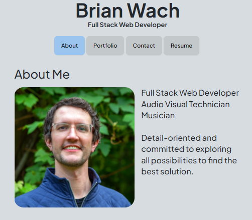
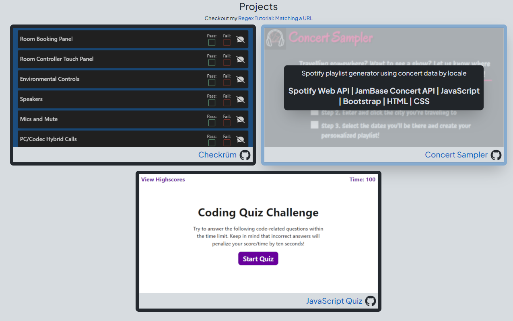

# Portfolio

## Description

This is a web development portfolio built as a single page web application using React.  

- This application was built with Vite in a Node.js environment.  
- It is a single page application using the [react-router-dom](https://www.npmjs.com/package/react-router-dom) package to enable page history navigation.
- It utilizes [Tailwind CSS](https://tailwindcss.com/) and [Daisy UI](https://daisyui.com/) for stylings.  
- In addition, the page uses the [vite-plugin-pwa](https://www.npmjs.com/package/vite-plugin-pwa/v/0.9.1) to register a service worker to cache static assets for better performance.
- Projects can be easily updated via an exported object in the data folder directory.  Screenshots of the example application should have a resolution of 764x430.
- With no back end, the contact form is functional by using [EmailJS](https://www.emailjs.com/).

## Table of Contents

- [Usage](#usage)
- [License](#license)
- [Questions](#questions)

## Usage

Here is the [Deployed Application](https://brianwach.netlify.app/) hosted by [Netlify](https://www.netlify.com/).

Here is the [Code Repository](https://github.com/briandwach/portfolio-react).

- When first visiting the portfolio site you will land on a simple about page.  Click the navigation tabs to be directed to other content.

  

- On the portfolio page, hover over the project images to learn about the technologies used (or click the info button on mobile).  Click anywhere on the image or title to be directed to the live application. Click on the Github logos to view the project repositories.

  

- The contact page features a form to sign up to send a message via email using [EmailJS](https://www.emailjs.com/). User input is validated before the form can be successfully submitted.

  

- On the last page there is a link to download my resume.  Lastly, there are links to my profiles on third party sites available in the footer on each page.

  

## License
This application is covered under the [MIT License](http://choosealicense.com/licenses/mit/).

## Questions
Please email me with any questions regarding this application at: brian.d.wach@gmail.com

Additionally, checkout more of my work on GitHub: [briandwach](https://github.com/briandwach)