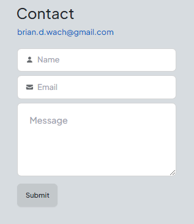
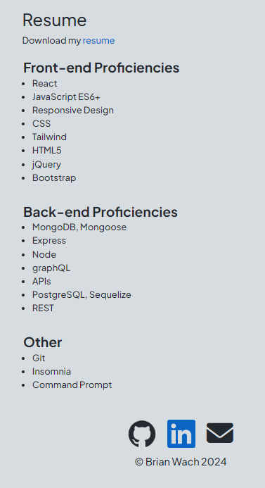

# Portfolio

## Description

This is a web development portfolio built as a single page web application using React.  

- This application was built with Vite in a Node.js environment.  
- It is a single page application using the react-router-dom package to enable page history navigation.
- Projects can be easily updated via an exported object in the data folder directory.  Screenshots of the example application should be of a 1920x1080 resolution.
- There is no backend currently for this application so information from users that signup with their email and send a message are only stored in local storage and console logged.

## Table of Contents

- [Usage](#usage)
- [License](#license)
- [Questions](#questions)

## Usage

Here is the [Deployed Application](https://briandwachportfolio.netlify.app/) hosted by [Netlify](https://www.netlify.com/).

Here is the [Code Repository](https://github.com/briandwach/portfolio-react).

- When first visiting the portfolio site you will land on a simple about page.  Click the navigation tabs to be directed to other content.

  

- On the portfolio page, click on the project images or title to be directed to the site for the live application. Click on the Github logos to view the project repositories.

  

- The contact page features a form to sign up for an email newsletter and send a message.  There is no backend database at this time so this info is only stored in local storage in the browser. User input is validated before the form can be successfully submitted.

  

- On the last page there is a link to download my resume.  Lastly, there are links to my profiles on third party sites available in the footer on each page.

  

## License
This application is covered under the [MIT License](http://choosealicense.com/licenses/mit/).

## Questions
Please email me with any questions regarding this application at: brian.d.wach@gmail.com

Additionally, checkout more of my work on GitHub: [briandwach](https://github.com/briandwach)